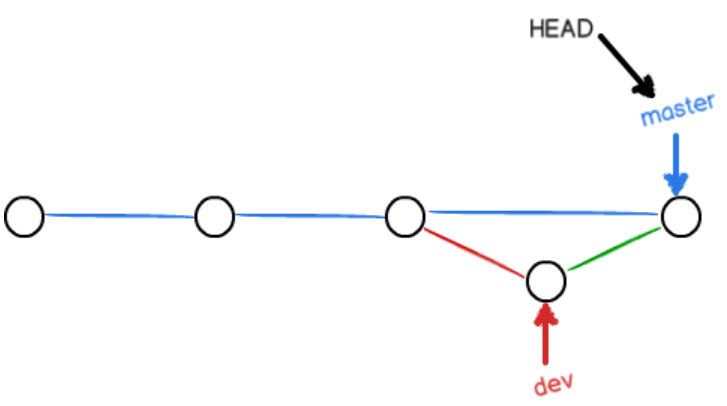

1 简介

目前世界上最先进的分布式版本控制系统

### 2 安装

```shell
$ git config --global user.name "Your Name"
$ git config --global user.email "email@example.com"
```

- 注意`git config`命令的`--global`参数，用了这个参数，表示你这台机器上所有的Git仓库都会使用这个配置，当然也可以对某个仓库指定不同的用户名和Email地址。

### 3 创建版本库

- 版本库又名仓库，英文名**repository**，你可以简单理解成一个目录，这个目录里面的所有文件都可以被Git管理起来，每个文件的修改、删除，Git都能跟踪，以便任何时刻都可以追踪历史，或者在将来某个时刻可以“还原”。

- 1. 选择一个合适的地方，创建一个空目录：

  ```shell
  $ mkdir learngit 
  $ cd learngit
  $ pwd
  /Users/michael/learngit
  ```
  
  - madir: 创建目录
  - cd: 跳转目录
  - pwd：查看当前目录
  
- 2. 通过`git init`命令把这个目录变成Git可以管理的仓库：

  ```shell
  $ git init
  Initialized empty Git repository in /Users/michael/learngit/.git/
  ```
  - 细心的读者可以发现当前目录下多了一个`.git`的目录，这个目录是Git来跟踪管理版本库的，没事千万不要手动修改这个目录里面的文件，不然改乱了，就把Git仓库给破坏了。
  - 如果你没有看到`.git`目录，那是因为这个目录默认是隐藏的，用`ls -ah`命令就可以看见。

- 添加文件到Git仓库，分两步：

  - 使用命令`git add <file>`，注意，可反复多次使用，添加多个文件；
  - 使用命令`git commit -m <message>`，完成

### 4 时光穿梭机

- 要随时掌握工作区的状态，使用`git status`命令。
- 如果`git status`告诉你有文件被修改过，用`git diff`可以查看修改内容。

#### 4.1 版本回退

- `HEAD`指向的版本就是当前版本，因此，Git允许我们在版本的历史之间穿梭，使用命令`git reset --hard commit_id`。
- 穿梭前，用`git log`可以查看提交历史，以便确定要回退到哪个版本。
- 要重返未来，用`git reflog`查看命令历史，以便确定要回到未来的哪个版本。

#### 4.2 工作区和暂存区

- **工作区（Working Directory）**就是你在电脑里能看到的目录，比如我的`learngit`文件夹就是一个工作区：

- **版本库（Repository）**

  - 工作区有一个隐藏目录`.git`，这个不算工作区，而是Git的版本库。

  - Git的版本库里存了很多东西，其中最重要的就是称为stage（或者叫index）的暂存区，还有Git为我们自动创建的第一个分支`master`，以及指向`master`的一个指针叫`HEAD`。

    

- 前面讲了我们把文件往Git版本库里添加的时候，是分两步执行的：

  第一步是用`git add`把文件添加进去，实际上就是把文件修改添加到暂存区；

  第二步是用`git commit`提交更改，实际上就是把暂存区的所有内容提交到当前分支。

  因为我们创建Git版本库时，Git自动为我们创建了唯一一个`master`分支，所以，现在，`git commit`就是往`master`分支上提交更改。

  你可以简单理解为，需要提交的文件修改通通放到暂存区，然后，一次性提交暂存区的所有修改。

#### 4.3 管理修改

- 为什么Git比其他版本控制系统设计得优秀，因为**Git跟踪并管理的是修改**，而非文件
- 每次修改，如果不用`git add`到暂存区，那就不会加入到`commit`中

#### 4.4 撤销修改

- 场景1：当你改乱了工作区某个文件的内容，想直接丢弃工作区的修改时，用命令`git checkout -- file`。
  - `git checkout`其实是用版本库里的版本替换工作区的版本，无论工作区是修改还是删除，都可以“一键还原”。
- 场景2：当你不但改乱了工作区某个文件的内容，还添加到了暂存区时，想丢弃修改，分两步，第一步用命令`git reset HEAD <file>`，就回到了场景1，第二步按场景1操作。
- 场景3：已经提交了不合适的修改到版本库时，想要撤销本次提交，参考[版本回退](https://www.liaoxuefeng.com/wiki/896043488029600/897013573512192)一节，不过前提是没有推送到远程库。

#### 4.5 删除文件

- 从版本库中删除该文件，那就用命令`git rm`删掉，并且`git commit`：

  ```shell
  $ git rm test.txt
  rm 'test.txt'
  
  $ git commit -m "remove test.txt"
  [master d46f35e] remove test.txt
   1 file changed, 1 deletion(-)
   delete mode 100644 test.txt
  ```

- 删错了，因为版本库里还有呢，所以可以很轻松地把误删的文件恢复到最新版本：

  ```shell
  $ git checkout -- test.txt
  ```

  - `git checkout`其实是用版本库里的版本替换工作区的版本，无论工作区是修改还是删除，都可以“一键还原”

### 5 远程仓库

- 由于你的本地Git仓库和GitHub仓库之间的传输是通过SSH加密的，所以，需要一点设置：

  - 第1步：创建SSH Key。在用户主目录下，看看有没有.ssh目录，如果有，再看看这个目录下有没有`id_rsa`和`id_rsa.pub`这两个文件，如果已经有了，可直接跳到下一步。如果没有，打开Shell（Windows下打开Git Bash），创建SSH Key：

    ```shell
    $ ssh-keygen -t rsa -C "youremail@example.com"
    ```

    如果一切顺利的话，可以在用户主目录里找到`.ssh`目录，里面有`id_rsa`和`id_rsa.pub`两个文件，这两个就是SSH Key的秘钥对，`id_rsa`是私钥，不能泄露出去，`id_rsa.pub`是公钥，可以放心地告诉任何人

  - 登陆GitHub，打开“Account settings”，“SSH Keys”页面：

    然后，点“Add SSH Key”，填上任意Title，在Key文本框里粘贴`id_rsa.pub`文件的内容：

#### 5.1 添加远程仓库

- 要关联一个远程库，使用命令`git remote add origin git@server-name:path/repo-name.git`；

  关联后，使用命令`git push -u origin master`第一次推送master分支的所有内容；

  此后，每次本地提交后，只要有必要，就可以使用命令`git push origin master`推送最新修改；

- 首先，登陆GitHub，然后，在右上角找到“Create a new repo”按钮，创建一个新的仓库：

- Repository name填入`learngit`，其他保持默认设置，点击“Create repository”按钮，就成功地创建了一个新的Git仓库：

- 我们根据GitHub的提示，在本地的`learngit`仓库下运行命令：

  ```shell
  $ git remote add origin git@github.com:glean18/learngit.git
  
  ```

  **注意**：` git@github.com:glean18/learngit.git`   <u>等同于</u> `git://github.com/glean18/learngit.git` 都是ssh，也可以使用`https://github.com/michaelliao/gitskills.git`这样的地址

- 添加后，远程库的名字就是`origin`，这是Git默认的叫法，也可以改成别的，但是`origin`这个名字一看就知道是远程库。

  把本地库的内容推送到远程，用`git push`命令，实际上是把当前分支`master`推送到远程。

  由于远程库是空的，我们第一次推送`master`分支时，加上了`-u`参数，Git不但会把本地的`master`分支内容推送的远程新的`master`分支，还会把本地的`master`分支和远程的`master`分支关联起来，在以后的推送或者拉取时就可以简化命令。

  ```shell
  $ git push -u origin master
  Counting objects: 20, done.
  Delta compression using up to 4 threads.
  Compressing objects: 100% (15/15), done.
  Writing objects: 100% (20/20), 1.64 KiB | 560.00 KiB/s, done.
  Total 20 (delta 5), reused 0 (delta 0)
  remote: Resolving deltas: 100% (5/5), done.
  To github.com:michaelliao/learngit.git
   * [new branch]      master -> master
  Branch 'master' set up to track remote branch 'master' from 'origin'.
  ```

- 从现在起，只要本地作了提交，就可以通过命令：

  ```shell
  $ git push origin master
  ```

  把本地`master`分支的最新修改推送至GitHub，现在，你就拥有了真正的分布式版本库！

- 注意：当你第一次使用Git的`clone`或者`push`命令连接GitHub时，会得到一个警告：

  ```sh
  The authenticity of host 'github.com (xx.xx.xx.xx)' can't be established.
  RSA key fingerprint is xx.xx.xx.xx.xx.
  Are you sure you want to continue connecting (yes/no)?
  ```

  这是因为Git使用SSH连接，而SSH连接在第一次验证GitHub服务器的Key时，需要你确认GitHub的Key的指纹信息是否真的来自GitHub的服务器，输入`yes`回车即可。

  Git会输出一个警告，告诉你已经把GitHub的Key添加到本机的一个信任列表里了：

  ```shell
  Warning: Permanently added 'github.com' (RSA) to the list of known hosts.
  ```

  这个警告只会出现一次，后面的操作就不会有任何警告了。

#### 5.2 从远程库克隆

- 首先，登陆GitHub，创建一个新的仓库，名字叫`gitskills`：

- 我们勾选`Initialize this repository with a README`，这样GitHub会自动为我们创建一个`README.md`文件。创建完毕后，可以看到`README.md`文件：

- 远程库已经准备好了，下一步是用命令`git clone`克隆一个本地库：

  ```shell
  $ git clone git@github.com:michaelliao/gitskills.git
  Cloning into 'gitskills'...
  remote: Counting objects: 3, done.
  remote: Total 3 (delta 0), reused 0 (delta 0), pack-reused 3
  Receiving objects: 100% (3/3), done.
  ```

  注意把Git库的地址换成你自己的，然后进入`gitskills`目录看看，已经有`README.md`文件了：

- **注意**：Git支持多种协议，包括`https`，但`ssh`协议速度最快

### 6 分支管理

#### 6.1 创建与合并分支

- 在Git里，这个分支叫主分支，即`master`分支。`HEAD`严格来说不是指向提交，而是指向`master`，`master`才是指向提交的，所以，`HEAD`指向的就是当前分支。

  

- 当我们创建新的分支，例如`dev`时，Git新建了一个指针叫`dev`，指向`master`相同的提交，再把`HEAD`指向`dev`，就表示当前分支在`dev`上：

  

  - 

- 从现在开始，对工作区的修改和提交就是针对`dev`分支了，比如新提交一次后，`dev`指针往前移动一步，而`master`指针不变：

  

- 我们在`dev`上的工作完成了，就可以把`dev`合并到`master`上。Git怎么合并呢？最简单的方法，就是直接把`master`指向`dev`的当前提交，就完成了合并：

  

- 合并完分支后，甚至可以删除`dev`分支。删除`dev`分支就是把`dev`指针给删掉，删掉后，我们就剩下了一条`master`分支：

  

- 查看分支：`git branch`

  创建分支：`git branch <name>`

  切换分支：`git checkout <name>`或者`git switch <name>`

  创建+切换分支：`git checkout -b <name>`或者`git switch -c <name>`

  合并某分支到当前分支：`git merge <name>`
  - “快进模式”`Fast-forward`，也就是直接把`master`指向`dev`的当前提交，所以合并速度非常快

  删除分支：`git branch -d <name>`

#### 6.2 解决冲突

- `master`分支和`feature1`分支各自都分别有新的提交，变成了这样

  
  - 这种情况下，Git无法执行“快速合并”，只能试图把各自的修改合并起来

  - 我们可以直接查看readme.txt的内容：

    ```shell
    Git is a distributed version control system.
    Git is free software distributed under the GPL.
    Git has a mutable index called stage.
    Git tracks changes of files.
    <<<<<<< HEAD
    Creating a new branch is quick & simple.
    =======
    Creating a new branch is quick AND simple.
    >>>>>>> feature1
    ```

    Git用`<<<<<<<`，`=======`，`>>>>>>>`标记出不同分支的内容，我们修改如下后保存：

    ```sh
    Creating a new branch is quick and simple.
    ```

  - 现在，`master`分支和`feature1`分支变成了下图所示：

    

- 用带参数的`git log`也可以看到分支的合并情况：

  ```shell
  $ git log --graph --pretty=oneline --abbrev-commit
  *   cf810e4 (HEAD -> master) conflict fixed
  |\  
  | * 14096d0 (feature1) AND simple
  * | 5dc6824 & simple
  |/  
  * b17d20e branch test
  * d46f35e (origin/master) remove test.txt
  * b84166e add test.txt
  * 519219b git tracks changes
  * e43a48b understand how stage works
  * 1094adb append GPL
  * e475afc add distributed
  * eaadf4e wrote a readme file
  ```

  最后，删除`feature1`分支：

  ```shell
  $ git branch -d feature1
  Deleted branch feature1 (was 14096d0).
  ```

#### 6.3 分支管理策略

- 通常，合并分支时，如果可能，Git会用`Fast forward`模式，但这种模式下，删除分支后，会丢掉分支信息。

  如果要强制禁用`Fast forward`模式，Git就会在merge时生成一个新的commit，这样，从分支历史上就可以看出分支信息。

- 准备合并`dev`分支，请注意`--no-ff`参数，表示禁用`Fast forward`：

  ```shell
  $ git merge --no-ff -m "merge with no-ff" dev
  Merge made by the 'recursive' strategy.
   readme.txt | 1 +
   1 file changed, 1 insertion(+)
  ```

  因为本次合并要创建一个新的commit，所以加上`-m`参数，把commit描述写进去

  

- **分支策略**: 

  首先，`master`分支应该是非常稳定的，也就是仅用来发布新版本，平时不能在上面干活；

  那在哪干活呢？干活都在`dev`分支上，也就是说，`dev`分支是不稳定的，到某个时候，比如1.0版本发布时，再把`dev`分支合并到`master`上，在`master`分支发布1.0版本；

  你和你的小伙伴们每个人都在`dev`分支上干活，每个人都有自己的分支，时不时地往`dev`分支上合并就可以了。

  

#### 6.4 Bug分支

- 每个bug都可以通过一个新的临时分支来修复，修复后，合并分支，然后将临时分支删除。

- 当你接到一个修复一个代号101的bug的任务时，很自然地，你想创建一个分支`issue-101`来修复它，但是，等等，当前正在`dev`上进行的工作还没有提交：

  - 幸好，Git还提供了一个`stash`功能，可以把当前工作现场“储藏”起来，等以后恢复现场后继续工作：

    ```sh
    $ git stash
    Saved working directory and index state WIP on dev: f52c633 add merge
    ```

    现在，用`git status`查看工作区，就是干净的（除非有没有被Git管理的文件），因此可以放心地创建分支来修复bug。

- 修复bug之后（在master分支），是时候接着回到`dev`分支干活了！

  - 工作区是干净的，刚才的工作现场存到哪去了？用`git stash list`命令看看：

    ```
    $ git stash list
    stash@{0}: WIP on dev: f52c633 add merge
    ```

    工作现场还在，Git把stash内容存在某个地方了，但是需要恢复一下，有两个办法：

    - 一是用`git stash apply`恢复，但是恢复后，stash内容并不删除，你需要用`git stash drop`来删除；

    - 另一种方式是用`git stash pop`，恢复的同时把stash内容也删了：

- dev分支是早期从master分支分出来的，所以，这个bug其实在当前dev分支上也存在。

  - Git专门提供了一个`cherry-pick`命令，让我们能复制一个特定的提交到当前分支：

    ```shell
    $ git branch
    * dev
      master
    $ git cherry-pick 4c805e2
    [master 1d4b803] fix bug 101
     1 file changed, 1 insertion(+), 1 deletion(-)
    ```

    Git自动给dev分支做了一次提交，注意这次提交的commit是`1d4b803`，它并不同于master的`4c805e2`，因为这两个commit只是改动相同，但确实是两个不同的commit。

#### 6.5 Feature分支

- 开发一个新feature，最好新建一个分支；

  如果要丢弃一个没有被合并过的分支，可以通过`git branch -D <name>`强行删除。

#### 6.6 多人协作

- 要查看远程库的信息，用`git remote`：

  ```shell
  $ git remote
  origin
  ```

  或者，用`git remote -v`显示更详细的信息：

  ```shell
  $ git remote -v
  origin  git@github.com:michaelliao/learngit.git (fetch)
  origin  git@github.com:michaelliao/learngit.git (push)
  ```

  上面显示了可以抓取和推送的`origin`的地址。如果没有推送权限，就看不到push的地址。

- 推送分支

  - 推送分支，就是把该分支上的所有本地提交推送到远程库。推送时，要指定本地分支，这样，Git就会把该分支推送到远程库对应的远程分支上：

    ```
    $ git push origin master
    ```

    如果要推送其他分支，比如`dev`，就改成：

    ```
    $ git push origin dev
    ```

    但是，并不是一定要把本地分支往远程推送，那么，哪些分支需要推送，哪些不需要呢？

    - `master`分支是主分支，因此要时刻与远程同步；
    - `dev`分支是开发分支，团队所有成员都需要在上面工作，所以也需要与远程同步；
    - bug分支只用于在本地修复bug，就没必要推到远程了，除非老板要看看你每周到底修复了几个bug；
    - feature分支是否推到远程，取决于你是否和你的小伙伴合作在上面开发。

- 抓取分支

  - 你的小伙伴从远程库clone时，默认情况下，你的小伙伴只能看到本地的`master`分支。不信可以用`git branch`命令看看：

    ```shell
    $ git branch
    * master
    ```

    现在，你的小伙伴要在`dev`分支上开发，就必须创建远程`origin`的`dev`分支到本地，于是他用这个命令创建本地`dev`分支：

    ```shell
    $ git checkout -b dev origin/dev
    ```

- 多人协作的工作模式：

  - 首先，可以试图用`git push origin <branch-name>`推送自己的修改；
  - 如果推送失败，则因为远程分支比你的本地更新，需要先用`git pull`试图合并；
  - 如果合并有冲突，则解决冲突，并在本地提交；
  - 没有冲突或者解决掉冲突后，再用`git push origin <branch-name>`推送就能成功！

  如果`git pull`提示`no tracking information`，则说明本地分支和远程分支的链接关系没有创建，用命令`git branch --set-upstream-to <branch-name> origin/<branch-name>`。

#### 6.7 Rebase ？？？？

### 7 标签管理

- tag标签：Git的标签虽然是版本库的快照，但其实它就是指向某个commit的指针（跟分支很像对不对？但是分支可以移动，标签不能移动），所以，创建和删除标签都是瞬间完成的。

#### 7.1 创建标签

- 命令`git tag <tagname>`用于新建一个标签，默认为`HEAD`，也可以指定一个commit id；

  命令`git tag -a <tagname> -m "blablabla..."`可以指定标签信息；

  命令`git tag`可以查看所有标签。

- 敲命令`git tag <name>`就可以打一个新标签：
  
  - 默认标签是打在最新提交的commit上

```shell
$ git tag v1.0
```


- 可以用命令`git tag`查看所有标签：

```shell
$ git tag
v1.0
```

- 在之前的提交上打标签：对应的commit id是`f52c633`，敲入命令：
  
  ```shell
  $ git tag v0.9 f52c633
  ```
  
- 注意，标签不是按时间顺序列出，而是按字母排序的。可以用`git show <tagname>`查看标签信息：

  ```shell
  $ git show v0.9
  commit f52c63349bc3c1593499807e5c8e972b82c8f286 (tag: v0.9)
  Author: Michael Liao <askxuefeng@gmail.com>
  Date:   Fri May 18 21:56:54 2018 +0800
  
      add merge
  
  diff --git a/readme.txt b/readme.txt
  ...
  ```

  可以看到，`v0.9`确实打在`add merge`这次提交上

- 还可以创建带有说明的标签，用`-a`指定标签名，`-m`指定说明文字：

```shell
$ git tag -a v0.1 -m "version 0.1 released" 1094adb
```

#### 7.2 操作标签

- 命令`git push origin <tagname>`可以推送一个本地标签；

  命令`git push origin --tags`可以推送全部未推送过的本地标签；

  命令`git tag -d <tagname>`可以删除一个本地标签；

  命令`git push origin :refs/tags/<tagname>`可以删除一个远程标签。

  

- 标签打错了，也可以删除：

  ```sh
  $ git tag -d v0.1
  Deleted tag 'v0.1' (was f15b0dd)
  ```
  - 因为创建的标签都只存储在本地，不会自动推送到远程。所以，打错的标签可以在本地安全删除。

- 如果要推送某个标签到远程，使用命令`git push origin <tagname>`：

  ```shell
  $ git push origin v1.0
  Total 0 (delta 0), reused 0 (delta 0)
  To github.com:michaelliao/learngit.git
   * [new tag]         v1.0 -> v1.0
  ```

  或者，一次性推送全部尚未推送到远程的本地标签：

  ```shell
  $ git push origin --tags
  Total 0 (delta 0), reused 0 (delta 0)
  To github.com:michaelliao/learngit.git
   * [new tag]         v0.9 -> v0.9
  ```

- 如果标签已经推送到远程，要删除远程标签就麻烦一点，先从本地删除：

  ```shell
  $ git tag -d v0.9
  Deleted tag 'v0.9' (was f52c633)
  ```

  然后，从远程删除。删除命令也是push，但是格式如下：

  ```sh
  $ git push origin :refs/tags/v0.9
  To github.com:michaelliao/learngit.git
   - [deleted]         v0.9
  ```